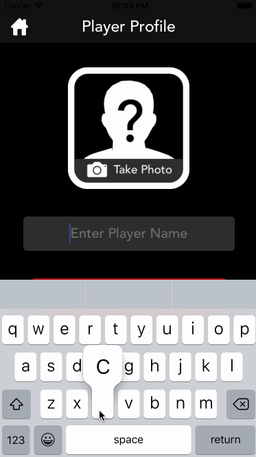
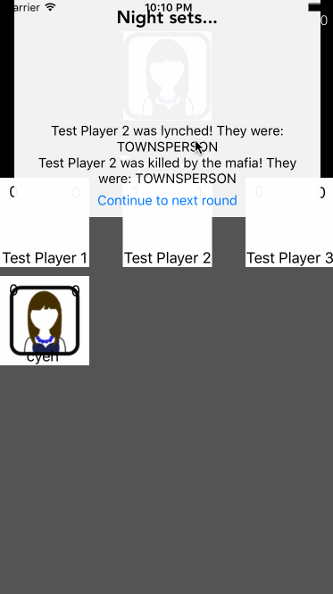

# Mafia

**Mafia** is an iOS implementation of the classic social game 'Mafia.' 
The back-end can be found at:
</a href="https://github.com/CubedBuddies/Mafia-Backend">https://github.com/CubedBuddies/Mafia-Backend</a>

## User Stories

The following functionality are **required**:

- [x] Home screen
  - [x] Creating a new game
  - [x] Joining an existing game
- [x] Lobby screen
  - [x] Starting the game
- [x] Game screen
  - [x] Voting
  - [x] Roles
  - [x] Countdown timer
- [x] Summary screen
  - [x] Processes actions for what happens in a stage of the game

The following functionality are **stretch**:

- [ ] More roles
  - [ ] Use a notification banner for next day information (i.e. you're a cop and you investigated X person, tells you what they were)
- [ ] Settings Page
  - [ ] Timer (max time per round)
  - [ ] Multiple Roles
- [ ] Accusations
- [ ] Notes per person
- [ ] Messaging (whisper + all-chat)
- [ ] Bounties
- [ ] Voice

The core-functionality is below:  

